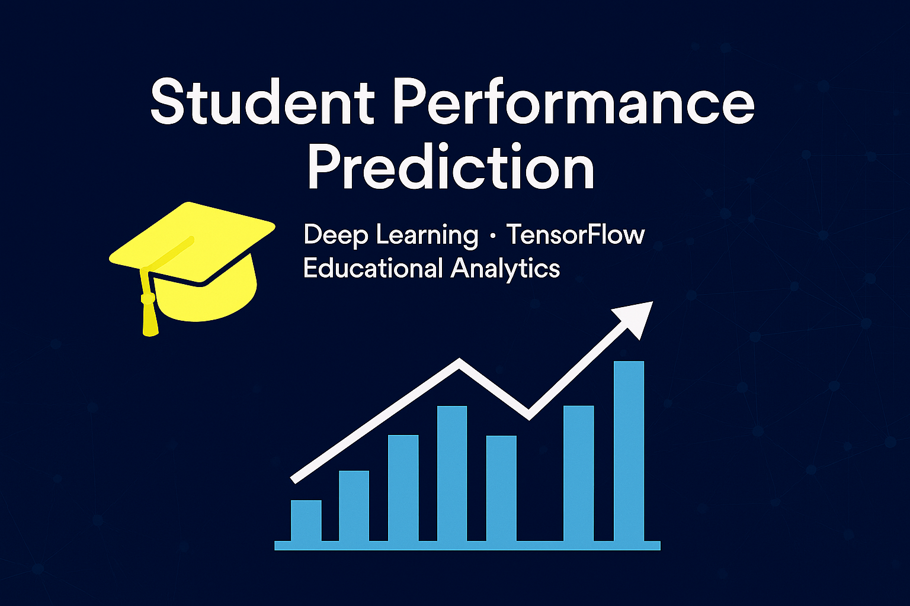
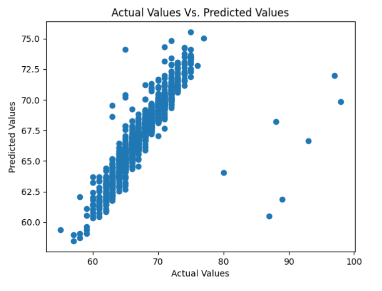
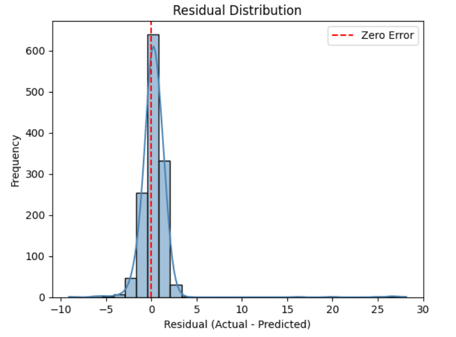

<!-- PROJECT BANNER -->
<p align="center">
  
</p>

<h1 align="center">🎓 Student Performance Prediction Using Deep Learning</h1>

<p align="center">
  
  
  
  
</p>

<p align="center">
  <b>Deep Learning • Education Analytics • Data Visualization</b><br>
  Predicting student performance with TensorFlow neural networks and data-driven insights.
</p>

> Visual summary of the project: predicting student performance using TensorFlow neural networks and educational analytics.

---

## 📘 Overview

This project applies **Deep Learning** to predict student performance from real-world data.  
It covers the full machine learning lifecycle — **data exploration**, **exploratory data analysis**, **preprocessing**, **modeling**, and **evaluation** — to extract actionable insights that enhance learning outcomes.

### 🔍 Objectives
- Analyze and visualize student performance patterns  
- Build predictive models using Artificial Neural Networks (ANNs)  
- Evaluate results using key metrics for regression and classification  

---

## ⚡ Key Features

✅ Complete data science pipeline (EDA → Modeling → Evaluation)  
✅ Built with TensorFlow/Keras for scalable deep learning  
✅ Interactive Jupyter Notebook walkthrough  
✅ Beautiful data visualizations for insights and interpretability  
✅ Reproducible and modular — ideal for research or education projects  

---

## 📂 Repository Structure

---

## 🧩 Technologies Used

| Category | Tools / Libraries |
|-----------|-------------------|
| **Language** | Python 3.10+ |
| **Data Processing** | NumPy, Pandas, Scikit-learn |
| **Visualization** | Matplotlib, Seaborn |
| **Modeling** | TensorFlow, Keras |
| **Environment** | Jupyter Notebook |

---

## 🧠 Model Architectures

This project features two deep learning models built with TensorFlow/Keras: one for regression and one for classification. Both models share a clean, interpretable architecture and are optimized for educational data.

### 🔹 Regression Model — Predicting Exam Scores
| Layer            | Configuration                     |
|------------------|-----------------------------------|
| Input Layer      | Receives preprocessed feature vector |
| Hidden Layer 1   | Dense(256), ReLU activation       |
| Dropout Layer    | Dropout(0.3)                      |
| Hidden Layer 2   | Dense(128), ReLU activation       |
| Hidden Layer 3   | Dense(64), ReLU activation        |
| Output Layer     | Dense(1)                          |
- Loss Function: Mean Squared Error (MSE)
- Optimizer: Adam
- Evaluation Metric: Mean Absolute Error (MAE)
  
> This model predicts continuous exam scores based on behavioral and academic features.


### 🔹 Classification Model — Performance Tier Prediction
| Layer            | Configuration                     |
|------------------|-----------------------------------|
| Input Layer      | Receives preprocessed feature vector |
| Hidden Layer 1   | Dense(128), ReLU activation       |
| Hidden Layer 2   | Dense(64), ReLU activation        |
| Output Layer     | Dense(3), Softmax activation      |
- Loss Function: Categorical Crossentropy
- Optimizer: Adam
- Evaluation Metric: Accuracy
  
> This model classifies students into three performance tiers: Low, Medium, and High

---

## 📉 Results & Evaluation

Model performance was evaluated using key metrics and visual diagnostics from the notebook.

### 📊 Regression Results
- **MSE:** ~4.48  
- **MAE:** ~0.89  
- **R² Score:** ~0.69  

**Evaluation Visuals:**
- Predicted vs. Actual grade scatter plot
  


- Training vs Validation Loss Curve
  


- Residual Distribution Plot
  



### 🧠 Classification Results
- **Training Accuracy:** 100%  
- **Validation Accuracy:** ~98%  

**Evaluation Visuals:**
- Training vs Validation Accuracy  


> The results indicate that both models generalize well, with stable learning curves and limited overfitting due to dropout and early stopping.

---

## 🚀 Installation

1. **Clone the repository**

```bash
git clone https://github.com/ArianJr/student-performance-deep-learning.git
cd student-performance-deep-learning
```

2. **Install dependencies**

```bash
pip install -r requirements.txt
```

---

## 🖥️ Usage

Open the Jupyter notebook to explore the analysis and models:

```bash
jupyter notebook student_performance_dl_analysis.ipynb
```

Follow the notebook to:

- 📊 Explore data distributions
- 🧠 Build and train models
- 📈 Evaluate predictive performance

---

## 📊 Visualizations

Visual insights play a key role in understanding student performance:

- **Correlation Heatmap:** Reveals relationships between features
- **Class Distribution:** Shows balance of target labels
- **Model Metrics:** Visualizes loss and accuracy trends

---

## 🔮 Future Improvements

- 🧩 **Feature Engineering:** Explore polynomial or interaction features  
- 🧠 **Hyperparameter Tuning:** Use `KerasTuner` or `Optuna` for optimal architectures  
- 🧾 **Cross-Validation:** Add k-fold validation to reduce variance  
- 📊 **Explainability:** Incorporate SHAP or LIME for feature importance visualization  
- ⚙️ **Deployment:** Wrap models in a Flask API or Streamlit dashboard for real-time prediction  
- 📈 **Data Expansion:** Include demographic and attendance trends for improved accuracy

---

## 📄 License

This project is licensed under the **MIT License**. See the [LICENSE](LICENSE) file for details.

---

## 🙏 Acknowledgments

- Dataset Source: [Add dataset link/citation]
- Libraries: TensorFlow, Keras, Pandas, NumPy, Matplotlib, Seaborn
- Inspired by educational data mining techniques and performance analytics research

---

## 💡 Author

**👤 Arian Jr**  
📧 [Contact Me](arianjafar59@gmail.com) • 🌐 [GitHub Profile](https://github.com/ArianJr)

---

<p align="center">
  Made with ❤️ by <a href="https://github.com/ArianJr" target="_blank">ArianJr</a>
</p>

<p align="center">
  <sub>⭐ If you found this project useful, please consider giving it a star! It helps others discover it and supports my work.</sub>
</p>

---

<p align="center">
  
  
</p>
